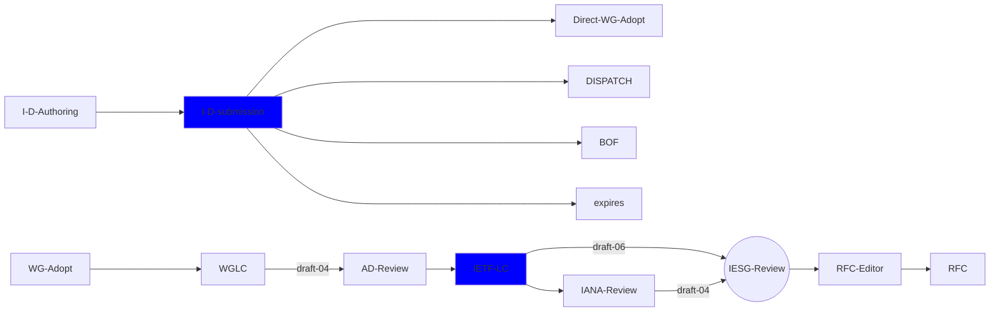

This page aims to diagrame the I-D submission process.

{: .banner}
Internet-Drafts (I-Ds) are the starting point for discussions in the IETF community. I-Ds may be the basis for Working Group efforts and evetually evolve into RFCs but most are either significantly transformed or abandoned over time.

## Additional work on and uses for this diagram

This diagram is created largely to 

#### [Problem Details for HTTP APIs](https://datatracker.ietf.org/doc/draft-ietf-httpapi-rfc7807bis/) - _[repository](https://github.com/ietf-wg-httpapi/rfc7807bis)_

See also the [official document listing](https://datatracker.ietf.org/wg/httpapi/documents/).

We talk about potential future work on the mailing list and in the [discussion repo](https://github.com/ietf-wg-httpapi/discussion/discussions).

## Who Should Participate

We think that the following sorts of people will be able to effectively contribute to this work:

* **HTTP standards experts**: Those with deep understanding of and experience with the protocol
* **API practitioners**: Those who create, operate, and use HTTP APIs often
* **API vendors**: Those who provide products (commercial or Open Source) for serving, designing, securing, etc. APIs

Others are, of course, welcome to join.

## How to Participate

**Everyone who participates needs to understand the [IETF NOTE WELL](https://www.ietf.org/about/note-well/) conditions**. This includes the Intellectual Property terms, code of conduct, and other important policies.

If you plan on actively participating, subscribing to the [working group mailing list](https://www.ietf.org/mailman/listinfo/httpapi) is encouraged but not required.

Anyone can make comments or pull requests to the specification repositories (see above).
