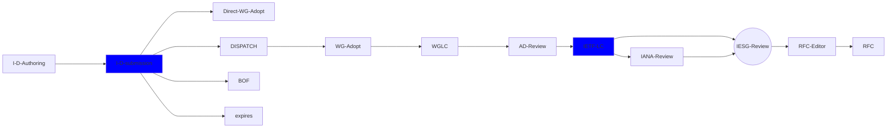

This page aims to diagrame the I-D submission process.

{: .banner}
Internet-Drafts (I-Ds) are the starting point for discussions in the IETF community. I-Ds may be the basis for Working Group efforts and evetually evolve into RFCs but most are either significantly transformed or abandoned over time.

## Additional work on and uses for this diagram

This diagram is created to further understand the flow of I-Ds in the IETF. It may be teh bases for 

#### Generic I-D flow within the IETF

#### Information about authoring Internet-Drafts
The [authors.ietf.org](https://authors.ietf.org) site is the central resource site for authors of an Internet-Draft (I-D), with information on how to write an I-D and the tools available to support this.

## Note Well

**Everyone who submits and I-D to the IETF repository needs to understand the [IETF NOTE WELL](https://www.ietf.org/about/note-well/) conditions**. This includes the Intellectual Property terms, code of conduct, and other important policies.
